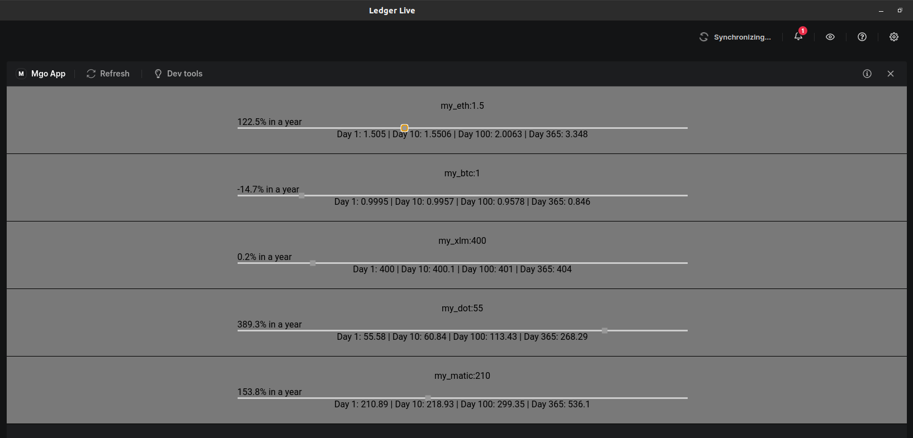

## Why ?

There are 2 main reasons:

- For fun, I wanted to try to implement a (simplified) DDD architecture in a react app.
- And I wanted to build a simple Ledger Live App following [this turorial](https://developers.ledger.com/docs/platform-app/tutorial/introduction/).

## What does it do ?

The app gets the info about your assets already known by the Ledger Live Desktop, and displays a fake (that you choose) "annual growth" evolution on each of them.
It's not useful, neither pretty. The goal was really to try to create a Ledger Live App and implement a simple DDD architecture.

<details>
  <summary>An incredible screenshot</summary> 

</details>

## The Architecture

- [domain](./src/domain) contains the domain entities (here [Asset](./src/domain/asset.entity.ts)) and value objects, and thus the business logic. As the business logic is separated from the rest of the app (no front-end, no api calls), it is easier to [test](./src/domain/asset.entity.test.ts).
- [repositories](./src/repositories) contains the repositories that abstracts the technology used to fetch data.
- [components](./src/components) contains the front app logic.
- [drivers](./src/drivers) contains the technology implementation to fetch data from "outside" this application.

## Installation and run

Normally a simple:

```bash
# To install the dependencies:
yarn
# To run locally:
yarn start
# To run the test
yarn test
```

And then follow [this tutorial section](https://developers.ledger.com/docs/platform-app/tutorial/4-test/) to access the app in Ledger Live.
